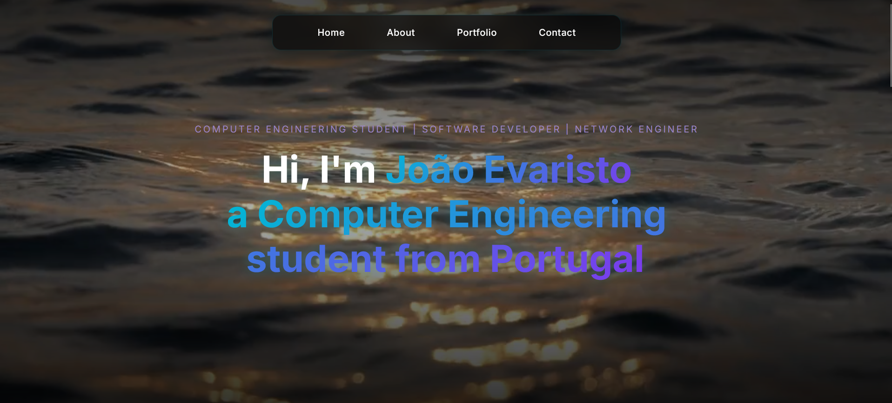
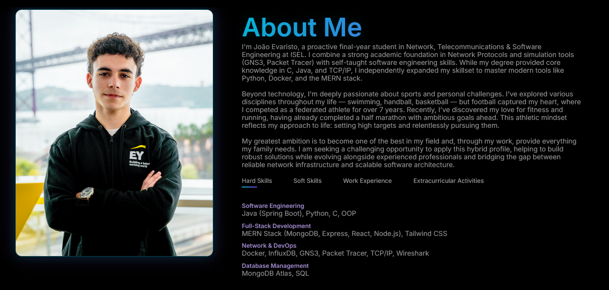
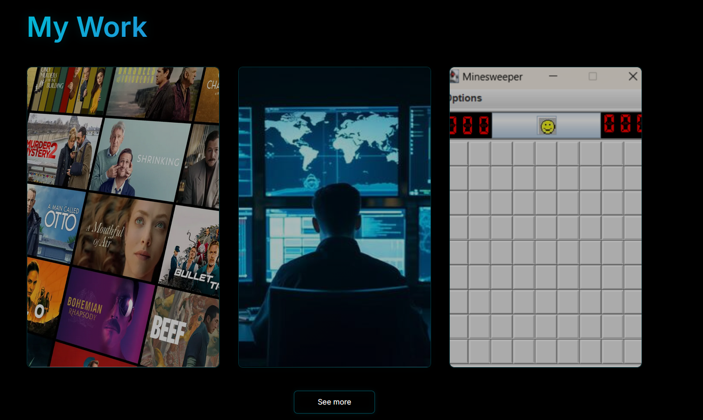
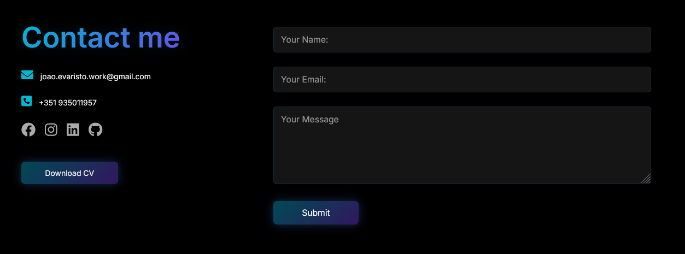

<div align="center">

# João Evaristo | Professional Portfolio

[](https://joaoevaristo11.github.io/My-Website/)
[](https://github.com/joaoevaristo11/My-Website)
[](LICENSE)

**A modern, responsive portfolio website showcasing my work in Computer Engineering, Software Development, and Network Engineering.**

[View Live Demo](https://joaoevaristo11.github.io/My-Website/) • [Report Bug](https://github.com/joaoevaristo11/My-Website/issues) • [Request Feature](https://github.com/joaoevaristo11/My-Website/issues)

</div>

---

## 📋 Table of Contents

- [Overview](#-overview)
- [Key Features](#-key-features)
- [Tech Stack](#-tech-stack)
- [Project Structure](#-project-structure)
- [Getting Started](#-getting-started)
- [Architecture](#-architecture)
- [Screenshots](#-screenshots)
- [Roadmap](#-roadmap)
- [Contact](#-contact)

---

## 🎯 Overview

This portfolio website serves as a comprehensive showcase of my professional work, technical skills, and project portfolio. Built with clean, semantic HTML5, modular CSS architecture, and vanilla JavaScript, it demonstrates best practices in modern web development.

### Purpose
- **Professional Presence**: Establish a strong online presence for career opportunities
- **Project Showcase**: Display my technical projects with detailed descriptions and live demos
- **Skills Demonstration**: Highlight proficiency in Computer Engineering, Networks, and Software Development
- **Contact Hub**: Provide an accessible platform for professional networking

---

## ✨ Key Features

### 🎨 User Experience
- **Responsive Design**: Fully optimized for desktop, tablet, and mobile devices
- **Video Background**: Dynamic video hero section for visual impact
- **Smooth Animations**: CSS transitions and JavaScript interactions for enhanced UX
- **Interactive Navigation**: Mobile-friendly hamburger menu with smooth scrolling

### 🛠️ Technical Implementation
- **Modular CSS Architecture**: Organized stylesheets by component for maintainability
- **Semantic HTML5**: Structured markup following web standards
- **Vanilla JavaScript**: No framework dependencies, optimized performance
- **Cross-Browser Compatible**: Tested across modern browsers
- **Fast Loading**: Optimized assets and efficient code structure

### 📱 Sections
- **Hero Section**: Eye-catching introduction with dynamic typing effect
- **About**: Professional background, skills, and education tabs
- **Portfolio**: Featured projects with descriptions and links
- **Contact**: Interactive form and social media integration

---

## 🚀 Tech Stack

<div align="center">


</div>

### Core Technologies
- **HTML5**: Semantic markup and structure
- **CSS3**: Modern styling with Flexbox and Grid layouts
- **JavaScript (ES6+)**: Interactive features and DOM manipulation
- **Font Awesome 6**: Professional iconography

### Development Tools
- **Git**: Version control
- **GitHub Pages**: Hosting and deployment
- **VS Code**: Primary development environment

---

## 📁 Project Structure

```
My-Website/
│
├── index.html                 # Main HTML document
├── style.css                  # CSS module orchestrator (imports all modules)
├── script.js                  # JavaScript functionality
├── README.md                  # Project documentation
│
├── css/                       # Modular CSS architecture
│   ├── variables.css          # → CSS custom properties (colors, spacing, etc.)
│   ├── base.css               # → Global resets and base styles
│   ├── animations.css         # → Keyframes and animation definitions
│   ├── header.css             # → Hero section and navigation styles
│   ├── about.css              # → About section (bio, tabs, skills)
│   ├── portfolio.css          # → Portfolio grid and project cards
│   ├── contact.css            # → Contact form and footer
│   └── responsive.css         # → Media queries for all breakpoints
│
└── images/                    # Media assets
    ├── background_video.mp4   # Hero section video
    ├── profile.jpg            # Personal photo
    └── [project images]       # Portfolio thumbnails
```

### Architecture Benefits

| Benefit | Description |
|---------|-------------|
| **Modularity** | Each CSS file handles a specific section, reducing cognitive load |
| **Maintainability** | Changes to one section don't affect others, easier debugging |
| **Scalability** | New sections can be added by creating new CSS modules |
| **Collaboration** | Multiple developers can work on different modules simultaneously |
| **Performance** | Easier to identify and remove unused styles |

---

## 🏃 Getting Started

### Prerequisites
- A modern web browser (Chrome, Firefox, Safari, Edge)
- Basic understanding of HTML/CSS/JS (for modifications)

### Installation

1. **Clone the repository**
   ```bash
   git clone https://github.com/joaoevaristo11/My-Website.git
   ```

2. **Navigate to the project directory**
   ```bash
   cd My-Website
   ```

3. **Open in browser**
   ```bash
   # Windows
   start index.html

   # macOS
   open index.html

   # Linux
   xdg-open index.html
   ```

### Local Development

For live reloading during development, use a local server:

```bash
# Using Python 3
python -m http.server 8000

# Using Node.js (http-server)
npx http-server -p 8000

# Using VS Code Live Server extension
# Right-click index.html → "Open with Live Server"
```

Then navigate to `http://localhost:8000`

---

## 🏗️ Architecture

### CSS Module System

The stylesheet architecture follows a **modular approach** where `style.css` acts as the orchestrator:

```css
/* style.css - Module Orchestrator */
@import url('css/variables.css');    /* Design tokens */
@import url('css/base.css');         /* Global styles */
@import url('css/animations.css');   /* Reusable animations */
@import url('css/header.css');       /* Header component */
@import url('css/about.css');        /* About component */
@import url('css/portfolio.css');    /* Portfolio component */
@import url('css/contact.css');      /* Contact component */
@import url('css/responsive.css');   /* Media queries */
```

### Customization Guide

#### Modifying Styles
| Component | File | Description |
|-----------|------|-------------|
| Colors & Spacing | `css/variables.css` | Design system tokens |
| Global Styles | `css/base.css` | Typography, resets |
| Hero Section | `css/header.css` | Video background, navigation |
| About Section | `css/about.css` | Bio, tabs, skills |
| Portfolio Grid | `css/portfolio.css` | Project cards |
| Contact Form | `css/contact.css` | Form styling, footer |
| Mobile/Tablet | `css/responsive.css` | Breakpoints and adjustments |

#### Modifying Content
- **Text & Images**: Edit `index.html` (sections are clearly commented)
- **Interactivity**: Edit `script.js` (form handling, menu toggle, typing effect)

---

## 📷 Screenshots

### Desktop View


### About Section


### Portfolio Grid


### Contact Section


---

## 🗺️ Roadmap

### Planned Features
- [ ] Dark/Light theme toggle
- [ ] Multi-language support (Portuguese/English)
- [ ] Blog section for technical articles
- [ ] Accessibility improvements (WCAG 2.1 AA compliance)
- [ ] Performance optimization (lazy loading, WebP images)
- [ ] SEO enhancements (structured data, meta tags)
- [ ] Integration with Google Analytics
- [ ] Downloadable CV/Resume button

### Completed
- [x] Responsive design
- [x] Video background
- [x] Interactive portfolio section
- [x] Contact form
- [x] Mobile navigation

---

## 📬 Contact

**João Evaristo**  
Computer Engineering Student | Software Developer | Network Engineer

[](mailto:joao.evaristo.work@gmail.com)
[](https://linkedin.com/in/joão-evaristo)
[](https://github.com/joaoevaristo11)

---

## 📄 License

This project is open source and available under the [MIT License](LICENSE).

---

## 🌟 Support

If you found this project helpful or interesting, please consider:
- ⭐ **Starring the repository**
- 🐛 **Reporting issues** for bugs or improvements
- 🔄 **Sharing** with others who might benefit

---

<div align="center">

**Built with ❤️ by [João Evaristo](https://github.com/joaoevaristo11)**

</div>
